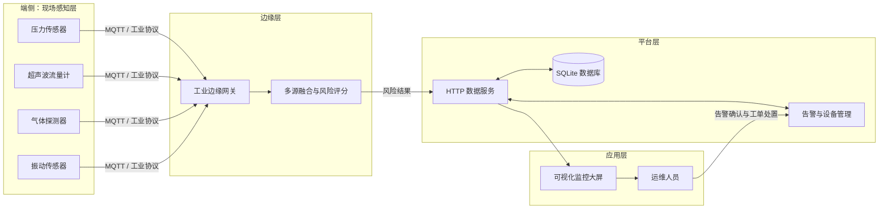

# PipeGuard 油气管道智能监测与泄漏预警系统

> 工业互联网概论课程小组项目：利用多源传感、边缘计算与云端可视化，实现油气管道运行状态监测、泄漏风险研判和告警处置闭环。

[](https://www.python.org/)
[](CHANGELOG.md)
[](#快速开始)
[](LICENSE)

## 项目简介

油气管道通常跨区域、环境复杂，单一传感器容易受到工况波动或设备噪声干扰。PipeGuard 构建了一个“端—边—云”工业互联网原型：

- **端侧感知**：模拟压力、进出口流量、可燃气体和振动等工业传感器；
- **边缘分析**：通过质量守恒与多信号关联，在数据源附近实时计算风险；
- **平台服务**：提供统一 HTTP API、SQLite 数据持久化、巡检、告警与工单生命周期管理；
- **应用展示**：以 Web 监控大屏展示管网状态、趋势、研判依据、运维进度与分析报告。

项目只使用 Python 标准库和原生 HTML/CSS/JavaScript，无需安装第三方依赖，适合课堂演示和原理讲解。

## 功能亮点

- 三条在役管线与 15 台感知设备的实时数据模拟
- 压力、流量、气体、振动四信号加权融合
- 0–100 风险评分、三级风险分级及可解释研判依据
- 监控总览、管线趋势、设备资产、巡检计划、告警中心、运维工单、分析报告和数据中心八个功能页面
- 15 台设备台账入库，支持实时读数、搜索筛选、远程校准和状态管理
- 设备离线自动生成告警，恢复在线后自动闭环对应事件
- 巡检计划支持新建、筛选、开始、正常/异常结项和逾期统计
- 巡检发现异常时自动生成告警，实现现场检查与事件处置联动
- 泄漏场景一键注入，便于现场答辩演示
- 告警一键转工单，支持待处理、处理中、已完成的规范化流转
- 风险分布、告警闭环率、工单完成率、巡检完成率和运行评分统计
- 告警记录一键导出 CSV，便于课程报告留档
- SQLite 持久化遥测、设备、告警和工单，服务重启后业务数据不丢失
- 操作审计日志记录场景注入、设备校准、设备状态和工单流转
- 数据中心展示数据库状态、六张核心表规模与最近操作
- 设备、巡检、告警和工单均支持 CSV 导出
- 响应式页面，适配桌面、平板和手机
- 标准库单元测试与 API 集成测试

## 快速开始

环境要求：Python 3.6 或更高版本。

```bash
git clone https://github.com/lihanyu050826/PipeGuard.git
cd PipeGuard
python run.py
```

浏览器访问 [http://127.0.0.1:8000](http://127.0.0.1:8000)。

也可指定监听地址和端口：

```bash
python run.py --host 0.0.0.0 --port 8080
```

默认数据库文件为 `data/pipeguard.db`，也可以指定其他位置：

```bash
python run.py --database /opt/pipeguard/data/pipeguard.db
```

### 演示泄漏预警

1. 打开“管线监测”；
2. 选择任意管线；
3. 点击右上角“注入泄漏演示”并确认；
4. 观察压力下降、进出口流量差增大和风险分上升；
5. 进入“告警中心”，点击“转工单”；
6. 在“运维工单”中依次点击“开始处理”和“完成工单”；
7. 打开“分析报告”，查看告警闭环率、工单完成率和运行评分；
8. 打开“数据中心”，查看新增告警、工单和审计日志是否已写入 SQLite。
9. 打开“设备管理”，演示设备搜索、远程校准、离线告警和恢复在线。
10. 打开“巡检计划”，新建计划并依次演示开始巡检、异常结项和自动告警。

> 泄漏注入过程属于教学模拟，但产生的遥测、告警与工单会持久化到 SQLite 数据库。

## 系统架构



详细设计见 [系统架构文档](docs/architecture.md)。

## 泄漏风险算法

系统使用可解释的规则融合模型：

```text
基础风险 = 0.34 × 压降异常
         + 0.36 × 流量不平衡
         + 0.20 × 气体浓度异常
         + 0.10 × 振动异常
```

当压降与流量不平衡同时显著出现时增加相关性权重，以降低单传感器误报。最终分级如下：

| 风险分 | 级别 | 系统动作 |
| --- | --- | --- |
| 0–34 | 正常 | 持续采样 |
| 35–64 | 警告 | 提示关注、加密采样 |
| 65–100 | 严重 | 产生泄漏告警并进入处置流程 |

该算法强调课程演示中的透明性。实际生产系统需利用真实工况数据校准阈值，并与负压波、声学检测或机器学习模型交叉验证。

## 项目结构

```text
PipeGuard/
├─ pipeguard/
│  ├─ risk.py          # 多源融合风险算法
│  ├─ database.py      # SQLite 建表、持久化与审计
│  ├─ store.py         # 实时数据、巡检、告警、工单与模拟器
│  └─ server.py        # HTTP API 与静态资源服务
├─ data/                # 运行时 SQLite 数据目录
├─ web/
│  ├─ index.html       # 监控平台页面
│  ├─ styles.css       # 响应式视觉样式
│  └─ app.js           # API 调用、图表与交互
├─ tests/              # 单元测试与 API 测试
├─ docs/               # 课程报告、架构、API 和答辩资料
├─ run.py              # 启动入口
├─ Dockerfile
└─ README.md
```

## 测试

```bash
python -m unittest discover -s tests -v
```

当前共 26 项自动化测试，覆盖正常、警告、严重风险识别，演示数据完整性、管线查询、泄漏注入、告警确认、工单与巡检状态机、巡检异常告警联动、设备校准、离线/恢复联动、v1 数据库无损升级、SQLite 重启持久化、审计日志、运营统计、四类 CSV 导出和 Python 3.6 兼容性。

## 数据库设计

项目使用 Python 3.6 标准库自带的 SQLite，无需安装数据库服务或第三方驱动：

| 数据表 | 用途 |
| --- | --- |
| `telemetry` | 保存压力、流量、气体、振动和风险计算结果 |
| `alerts` | 保存风险告警及确认、关闭状态 |
| `work_orders` | 保存负责人、优先级和工单流转状态 |
| `devices` | 保存设备台账、在线状态、通信参数和校准周期 |
| `inspection_tasks` | 保存巡检计划、负责人、检查清单和现场结论 |
| `audit_logs` | 保存关键业务操作，支持追溯 |

遥测数据按管线自动保留最近 720 条，避免演示服务器长期运行导致数据库无限增长。Docker 部署时建议把 `/app/data` 挂载为持久卷。

## 文档

- [课程项目报告](docs/course-report.md)
- [系统架构设计](docs/architecture.md)
- [HTTP API 文档](docs/api.md)
- [答辩演示提纲](docs/presentation.md)
- [小组协作建议](docs/teamwork.md)
- [版本更新记录](CHANGELOG.md)

## 安全与适用范围

本仓库是用于教学和原型验证的模拟系统，不应直接用于真实油气管道生产控制。生产落地还需要工业防火墙、TLS 双向认证、设备身份管理、时序数据库、冗余部署、安全仪表系统联锁，以及符合行业规范的现场验证。

## 许可证

[MIT License](LICENSE) © 2026 PipeGuard Team
