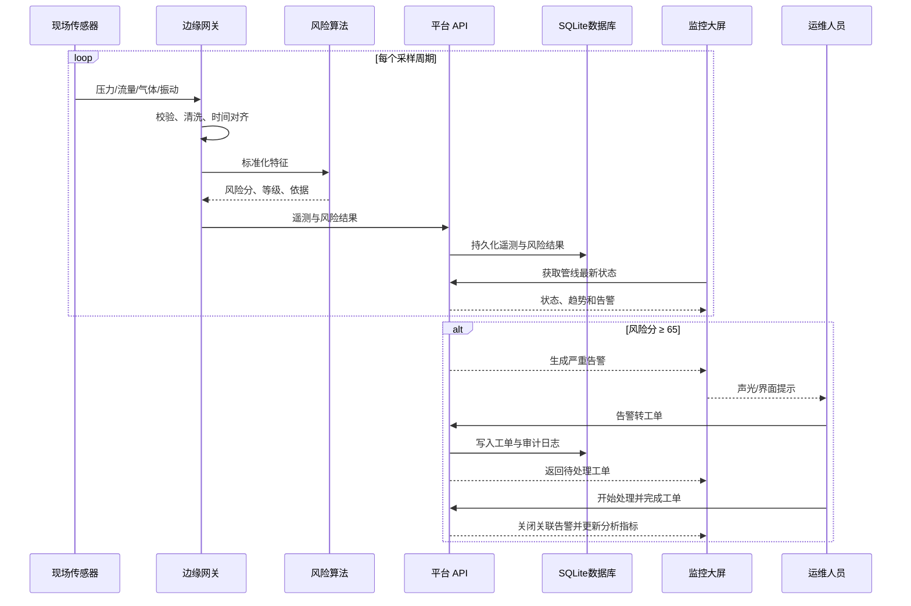

# PipeGuard 系统架构设计

## 1. 设计目标

PipeGuard 面向油气管道长距离、分布式、连续运行的特点，目标是建立低延迟、可解释、可扩展的泄漏预警原型。系统设计遵循四项原则：

1. 数据在端侧被可靠感知；
2. 关键风险在边缘侧快速判断；
3. 平台侧统一管理数据和事件；
4. 应用侧为运维人员提供可行动的信息。

## 2. 四层架构

### 2.1 现场感知层

现场设备包括压力变送器、超声波流量计、可燃气体探测器和振动传感器。原型每条管线配置四类设备，并在平台中建立 12 台设备台账，统一管理读数、信号、供电、在线状态与校准周期。生产环境可通过 Modbus RTU/TCP、OPC UA 或 HART 接入 PLC/RTU。

### 2.2 边缘计算层

工业边缘网关完成协议转换、时间对齐、异常值过滤和风险评分。把初步判断放在边缘侧有三个好处：

- WAN 网络中断时仍能本地预警；
- 减少原始高频数据上云带宽；
- 缩短“采集—判断—告警”的时延。

当前代码中的 `MonitoringStore` 与 `assess_leak_risk` 共同模拟边缘网关行为。

### 2.3 工业互联网平台层

平台层将设备、管线、遥测、巡检、告警和工单抽象为统一资源，并通过 HTTP API 服务应用。原型使用 SQLite 持久化历史遥测、设备资产、巡检计划、告警、工单和审计日志，在保持零第三方依赖的同时实现服务重启恢复。设备离线会触发告警，巡检异常也会自动生成告警，关键状态操作全部写入审计日志；生产环境可进一步替换为：

- 时序数据：InfluxDB、TimescaleDB；
- 资产与告警：PostgreSQL；
- 消息总线：MQTT Broker、Kafka；
- 服务治理：容器编排、指标监控、日志审计。

### 2.4 业务应用层

Web 大屏提供全网总览、管线监测、风险解释、设备管理、巡检计划、告警确认、工单处置、运营分析和数据中心。界面设计优先呈现“哪里异常、异常多严重、为什么判断异常、谁来检查、谁来处理、处理到哪一步、数据是否已经留痕”。

## 3. 数据流

## 4. 风险模型

四类信号先被归一化到 0–1：

- 压降：相对基线压降达到 25% 时计为满异常；
- 流量：进出口偏差达到入口流量 20% 时计为满异常；
- 气体：20 ppm 以上开始累计；
- 振动：1.5 mm/s 以上开始累计。

融合权重为压力 34%、流量 36%、气体 20%、振动 10%。压力和流量共同异常时增加 6% 或 13% 的关联增强。这样既保留了质量守恒法的主导地位，也利用环境和结构信号进行交叉验证。

## 5. 可靠性与安全设计

原型已体现 API 输入校验、路径越界保护、SQLite 事务、线程安全数据访问、操作审计及固定容量历史窗口。生产化还应增加：

- 双机边缘网关及断点续传；
- MQTT QoS 1/2 与离线消息；
- 设备证书、TLS、最小权限和安全审计；
- 网络分区，生产网与办公网隔离；
- 数据质量标签和传感器故障诊断；
- 告警抑制、升级、工单和应急联动；
- 算法版本管理、灰度发布和效果回溯。

## 6. 扩展方向

1. 接入真实 MQTT Broker 与 OPC UA Server；
2. 使用时序数据库保存长期历史；
3. 引入负压波到达时间差进行泄漏定位；
4. 使用历史工况训练 Isolation Forest 或 LSTM；
5. 增加 GIS 地图、电子围栏和移动端巡检；
6. 对接企业微信/短信及工单系统。
